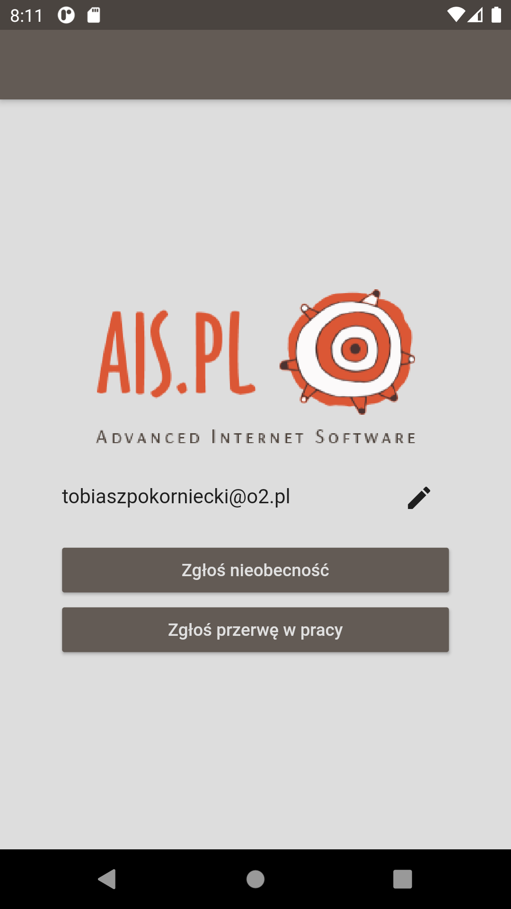
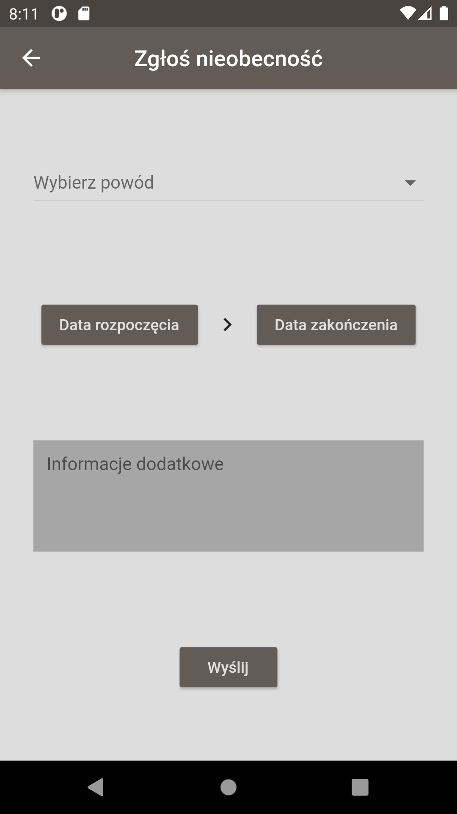
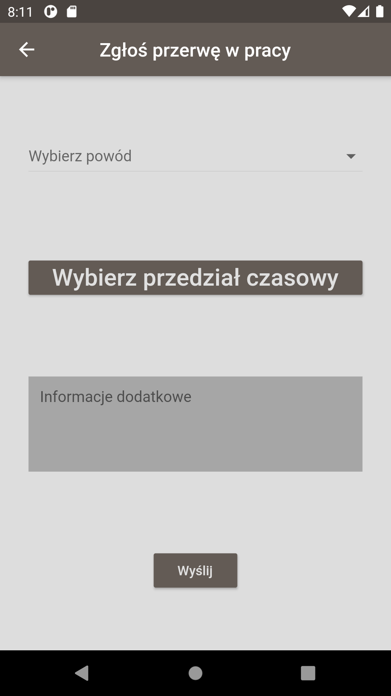

# AIS PROJECT

Obecnie nieobecności i przerwy w pracy 'ad hoc' zgłaszamy
e-mailem. Chcielibyśmy to zastąpić aplikacją mobilną, która ujednolici
te zgłoszenia.

Formularz aplikacji powinien zawierać pola:

- pole na e-mail osoby wysyłającej zgłoszenie. E-mail powinien być
zapamiętany i wypełniany automatycznie przy kolejnych uruchomieniach
- listę predefiniowanych powodów nieobecności
- zakres czasowy nieobecności
- pole tekstowe na opcjonalną informację dodatkową

W tej wstępnej wersji nie ma łączenia się z serwerem, chodzi tutaj
zaprojektowanie oszczędnego i funkcjonalnego UI.  Po naciśnięciu
kontrolki 'Wyślij' aplikacja powinna zwrócić na ekran tekst
powiadomienia z kontrolką 'Nowe zgłoszenie'.  Wybranie tej kontrolki
powinno przenieść użytkownika na ekran początkowy.

## Zdjęcia poglądowe

